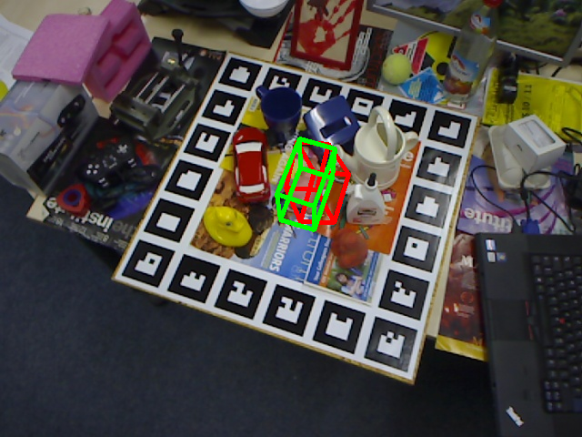

# e4040-2020fall-Project-POSE-sp3779-pmn2119
Seed repo for projects for e4040-2020Fall-project
  - distributed as Github Repo and shared via Github Classroom
  - contains only README.md file
  - Students must have at least one main Jupyter Notebook, and a number of python files in a number of directories and subdirectories such as utils or similar, as demonstrated in the assignments
  - The organization of the directories has to be meaningful

# Detailed instructions how to submit this assignment/homework/project:
1. The assignment will be distributed as a github classroom assignment - as a special repository accessed through a link
2. A students copy of the assignment gets created automatically with a special name - students have to rename the repo per instructions below
3. The solution(s) to the assignment have to be submitted inside that repository as a set of "solved" Jupyter Notebooks, and several modified python files which reside in directories/subdirectories
4. Three files/screenshots need to be uploaded into the directory "figures" which prove that the assignment has been done in the cloud

## (Re)naming of a project repository shared by multiple students (TODO students)
INSTRUCTIONS for naming the students' solution repository for assignments with more students, such as the final project. Students need to use a 4-letter groupID): 
* Template: e4040-2020Fall-Project-GroupID-UNI1-UNI2-UNI3. -> Example: e4040-2020Fall-Project-MEME-zz9999-aa9999-aa0000.

# Introduction

This projects aims to predict the pose of an object in a cluttered scene using convolutional residual neural networks. 
<p >
  
  
  
  
  Note: Green box represents the ground truth pose and red box represents predicted pose
</p>
Interface to the project is through the jupyter notebook 6DPE.ipynb.

To execute the notebook. Install the required packages in a conda environment from the file requirements.txt. This can be done by executing the following command:

$ conda create --name \<env\> --file requirements.txt

The dataset is parsed into appropriate directory structure in the notebook itself. After parsing, the dataset is saved in root directory as LineMOD_dataset. 

## Tensor Files
The trained models are available at:
https://drive.google.com/drive/folders/1guxX8XF1dZviTpT0OtTpxkrsTnhc4WFt?usp=sharing

Can be accessed using LionMail ID.

# Organization of this directory
```
e4040-2020fall-Project-POSE-sp3779-pmn2119
├── 6DPE.ipynb
├── Correspondance_Network.py
├── Correspondence.py
├── Demo_images
├── Evaluated_Images
├── Helper.py
├── LineMOD.py
├── LineMOD_Dataset
├── PoseRefinement.py
├── Pose_estimation.py
├── Test.py
├── UV_mapping.py
├── _pycache_
├── correspondence_block.pt
├── ground_truth.py
├── pose_refiner.pt
├── requirements.txt
└── val2017
```
To be populated by students, as shown in previous assignments
